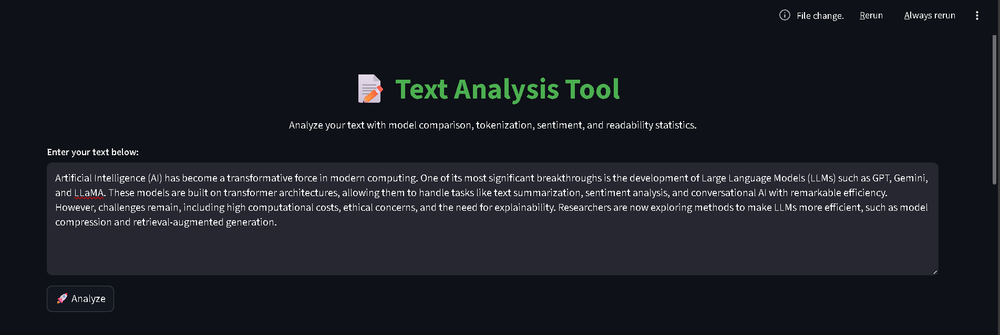
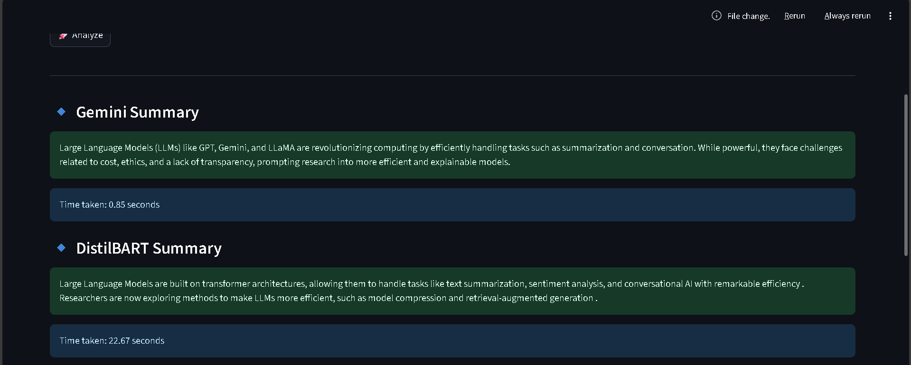
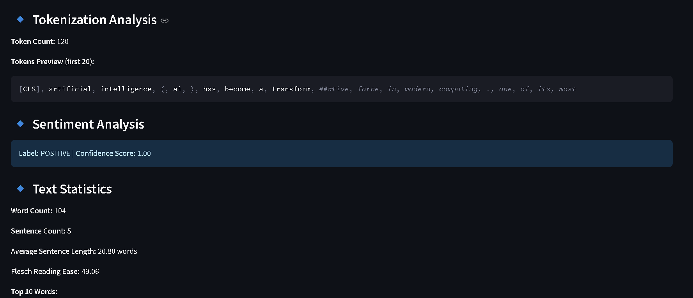
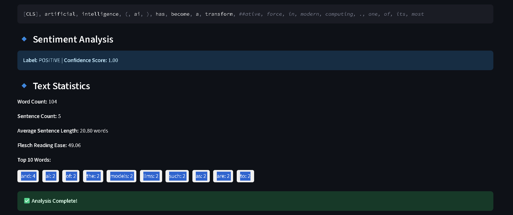

# Project Documentation – Text Analysis Tool

This project is a Text Analysis Tool that leverages the Google Gemini API, Transformers (Hugging Face), and Sentiment Analysis models to analyze and summarize text effectively. The goal is to provide a modular, reusable, and error-resilient implementation that can be enhanced in the future.

### 1. Project Overview

The project performs three key tasks:

Text Summarization using Gemini API (google.generativeai).

Sentiment Analysis with Hugging Face Transformers & NLTK.

Reusable, modular helper functions to avoid repetitive code and handle API limits gracefully.

This tool is designed with clean code principles, error handling, and a streamlined user interface via Streamlit.

### 2. API Usage Workflow

The project integrates with Google Gemini API for summarization. Here's how it works:

* API Key Security:

- API key is stored securely in a .env file.

- python-dotenv is used to load environment variables safely.

* Configuration:

- google.generativeai is configured with the API key.

* Reusable API Function:

- summarize_text(text) function in utils/llm_helpers.py handles Gemini API calls.

- It takes raw text input and returns a concise summary.

* Error Handling & Rate Limiting:

- Network/API errors are caught, logged, and handled gracefully.

- If the rate limit is hit, the function waits before retrying instead of crashing the app.
````
### 3. Project Structure:

TEXT_ANALYSIS_TOOL/
├── README.md
├── main.py
├── requirements.txt
├── config.py
├── utils/
│   ├── __init__.py
│   ├── llm_helpers.py
│   └── tokenizer_helpers.py
|   ├── advanced_features.py
├── data/
│   ├── sample_texts/
| 
└── docs/
    └── usage_examples.md
````
### 4. Requirements & Installation

Make sure you have Python 3.8+ installed. Then follow these steps:

1. Create and activate a virtual environment (recommended):

python -m venv venv
source venv/bin/activate      # macOS/Linux
venv\Scripts\activate         # Windows


2. Install dependencies:

pip install -r requirements.txt


* Dependencies include:

- google-generativeai – for Gemini API integration
- python-dotenv – for environment variable handling
- transformers – for Hugging Face models
- nltk – for NLP preprocessing and sentiment analysis
- torch – backend for transformers
- streamlit – interactive frontend
- pytest – testing framework

### 5. How to Run the App

* Run the project locally with:

- streamlit run main.py


After running, a local Streamlit web interface will open where you can upload or paste text for analysis.

### 6. Example Usage

Take any text to test the tool inside:
data/sample_texts/

The tool will return:

- Summarized text (via Gemini API).
- Sentiment analysis (Positive, Negative, Neutral).
- Key insights from the text.

### 7.Future Enhancements

- Add topic extraction & keyword analysis.
- Support for multiple languages.
- Enhance the UI with visual sentiment graphs.
- Add database integration for storing analysis history.

### Conclusion:

This project demonstrates:

- Clean architecture with helper modules.
- Proper API integration (Gemini + Transformers).
- Error resilience with retry & logging.
- A simple UI with Streamlit.

It’s designed to be developer-friendly, scalable, and easy to build upon for future enhancements.





